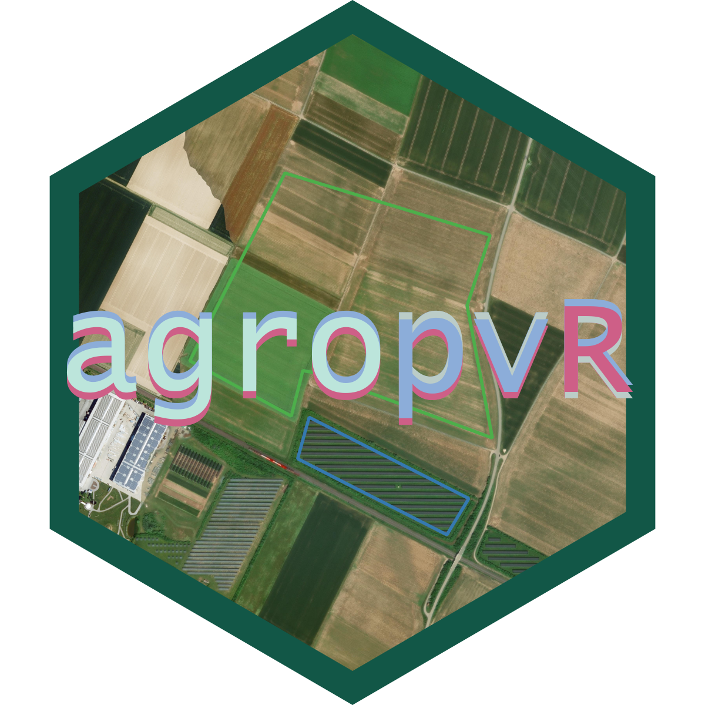

# agropvR

agropvR is an R package for mapping and analysing the environmental 
impact of agrophotovoltaic facilities on agricultural fields in Bavaria 
and Baden-Württemberg, Germany, using Sentinel-2 satellite imagery.

Agrophotovoltaic facilities combine solar energy production with agricultural
land use. This package allows users to compare vegetation and soil 
conditions between agrovoltaic sites and paired reference fields using 
three spectral indices:

- **NDVI** — Normalised Difference Vegetation Index (vegetation health)
- **NDMI** — Normalised Difference Moisture Index (moisture content)
- **BSI** — Bare Soil Index (soil exposure)

## Installation

```r
# install from GitHub
devtools::install_github("marlenecss/agropvR")
```

## Data

The package includes two built-in datasets digitised from the 
[Fraunhofer ISE Agrivoltaics Map](https://agrivoltaicsmap.ise.fraunhofer.de/):

- `sites` — 25 agrovoltaic facility polygons across Bavaria and Baden-Württemberg
- `fields` — 25 paired reference agricultural field polygons

```r
library(agropvR)

# inspect the data
head(sites)
head(fields)
```

## Workflow

## SETUP
```r
install.packages("devtools")
devtools::install_github("marlenecss/agropvR")
library(agropvR)
```

## STEP 1 — download pre-computed cache from Zenodo
downloads all pre-computed .rds and .tif files
only needs to be run once — skips files already present
requires internet connection and some disk space
```r
download_cache()
```

## STEP 2 - check which sites and months are available
limited due to 30% cloud cover
```r
available_sites()
```

## STEP 3 — load results for a site
replace site_id number with site of choice
replace site_id number in subsequent functions
```r
results <- load_site_results(site_id = 1)
```

or load specific months only
```r
results <- load_site_results(
  site_id = 1,
  months  = c("2024-06", "2024-07", "2024-08")
)
```

## STEP 4 — plot index time series
compares NDVI, NDMI and BSI between the
agrovoltaic site and its paired reference field
shaded band = mean +/- 1 standard deviation
```r
plot_indices(results, site_id = 1)
```

## STEP 5 — map indices spatially
maps all three indices side by side for one site and month
loads from local cache — no download needed after Step 1
```r
map_indices(site_id = 1, month = "2024-07")
```

## STEP 6 — compare system types
compares overhead vs interspace agrovoltaic systems
load results from multiple sites and combine them
```r
results_multi <- dplyr::bind_rows(
  load_site_results(site_id = 1),
  load_site_results(site_id = 2),
  load_site_results(site_id = 3)
  # add more sites as needed, up to 25
)
```

summary table: mean and SD per index per system type
```r
compare_system_types(results_multi)
```

bar chart comparing system types across all three indices
```r
plot_system_types(results_multi)
```

## OPTIONAL — collect data for a missing site/month
instead of this
```r
collect_site_data(
  site_sf   = sites[1, ],
  field_sf  = fields[1, ],
  site_id   = 1,
  month     = "2024-05"
)
```

you could try raising the cloud cover threshold
use with caution as cloudy scenes affect index quality
```r
collect_site_data(
  site_sf   = sites[1, ],
  field_sf  = fields[1, ],
  site_id   = 1,
  month     = "2024-05",
  max_cloud = 50
)
```
or look for data in 2025
```r
collect_site_data(
 site_sf = sites[1, ],
 field_sf = fields[1, ],
 site_id = 1,
 month = "2025-04",
 max_cloud = 30
)
```

## Notes

- Cloud cover is limited to a maximum of 30% when searching for 
  Sentinel-2 scenes. If no suitable scene is found for a given month, 
  try a different month.
- Cached results are stored in `data/cache/` and are not included in 
  the package repository. Each user runs `collect_site_data()` on 
  their own machine.
- Sentinel-2 imagery is accessed via the 
  [Element84 Earth Search STAC API](https://earth-search.aws.element84.com/v1).
